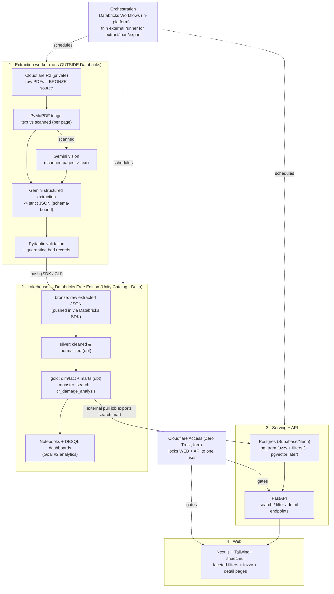

# MadTitan Bestiary — Architecture

> End-to-end data platform that converts a library of D&D 5e bestiary PDFs into
> (1) a fast, deeply-filterable private monster search tool for a DM, and
> (2) a comprehensive analytics workbench over all monster data.

---

## 1. Goals & non-goals

### Goals
- Turn ~50 bestiary PDFs (~100 monsters each ≈ **~5,000 monsters**) into clean,
  **comprehensive** structured data — *every* attribute, down to individual attacks,
  traits, legendary/lair actions, spellcasting, and lore.
- A **private website** for fast monster discovery: fuzzy name search, full-text
  search inside traits/actions, and rich faceted filtering.
- A **deep analytics** layer for reports such as "average damage/round vs CR".
- Be a **portfolio-grade** showcase across **data engineering**, **analytics
  engineering**, and **full-stack web**.

### Non-goals (for v1)
- Multi-user / public access (single user only).
- Compare-side-by-side, favorites, random generator (deferred).
- Spells, monster creation, encounter simulator (future domains — see §12).

### Guiding constraints
| Constraint | Implication |
|---|---|
| **~$0/month** | Free tiers only; tiny structured data keeps compute trivial. |
| **Private data, public code** | Code may be public on GitHub; book data never enters the repo or any public surface. |
| **State-of-the-art stack** | Lakehouse + dbt + LLM extraction + modern web. |
| **Extensible** | New domains (spells/encounters) slot into the same warehouse. |

### Sense of scale
The **structured** data is small: ~5,000 monsters × full detail ≈ a few MB / low
millions of rows across fact tables. The "many GB" is only the **raw PDFs** (a storage
concern, not a compute one). This is why every query-side component can live on a free
tier comfortably, and why scaling future domains is about *modeling*, not *infra size*.

---

## 2. System overview

Four clearly-separated systems, plus cross-cutting security and infra.



---

## 3. Tech stack & cost

| Layer | Technology | Cost | Rationale |
|---|---|---|---|
| Raw storage (Bronze) | **Cloudflare R2** (private bucket) | $0 (10 GB free, **no egress**) | Cheap private blob store; keeps heavy PDFs out of the repo. |
| PDF parsing / triage | **PyMuPDF** (`fitz`) / pdfplumber | $0 | Detect text vs scanned per page; extract text & page images. |
| LLM extraction | **Google Gemini** free tier (text + vision) | $0 (within quota) | Strong structured output + vision for scanned pages. |
| Validation | **Pydantic v2** | $0 | Schema contract + quarantine; data-quality story. |
| Lakehouse / warehouse | **Databricks Free Edition** (Delta Lake + Unity Catalog) | $0 | Medallion architecture; résumé centerpiece. |
| Transformations | **dbt** (`dbt-databricks`) | $0 | Versioned, tested, documented modeling. |
| Orchestration | **Databricks Workflows** + thin external runner (GitHub Actions / Make) | $0 | In-platform for in-warehouse steps; external for steps Databricks can't reach (see §5). |
| Serving DB | **Postgres** (Supabase or Neon free tier) | $0 | `pg_trgm` fuzzy search, standard indexes for facets, `pgvector`-ready. |
| API | **FastAPI** (Fly.io / Render free) | $0 | Python-first, async, auto OpenAPI docs. |
| Web | **Next.js + TypeScript + Tailwind + shadcn/ui** (Vercel / CF Pages) | $0 | Modern, fast, great UX for faceted search. |
| Analytics / BI | **Databricks notebooks + DBSQL dashboards** (optional **Evidence.dev**) | $0 | Goal #2 reports; git-based static BI option. |
| Security | **Cloudflare Access** (Zero Trust, free ≤50 users) | $0 | Gates the whole app to one identity; no auth code. |
| IaC / CI | **Terraform** + **GitHub Actions** | $0 | Reproducible infra; CI for dbt tests/lint/deploy. |

---

## 4. The four systems in detail

### System 1 — Ingestion & extraction
- **Bronze storage:** raw PDFs in a **private R2 bucket** (encrypted, never public).
  50 books ≈ a few GB; if it exceeds R2's 10 GB free tier, add Backblaze B2 (also 10 GB
  free).
- **Triage:** `PyMuPDF` checks each page for a real text layer. Text pages are parsed
  directly; **scanned pages** are rendered to images and sent through Gemini vision.
  This cleanly handles the **mixed** (text + scanned) reality of the library.
- **Extraction:** Gemini is called with **structured output / function calling** bound
  to the monster JSON schema (§7). One stat block → one JSON object. LLM extraction is
  robust to the inconsistent layouts across 50 different publishers/books — far more so
  than regex.
- **Validation & quarantine:** **Pydantic** models enforce types, enums (e.g. damage
  types, sizes, creature types), and required fields. Failures are written to a
  `quarantine/` area alongside the source page reference for manual review and re-run.
- **Provenance:** every record carries source book, page, extraction model, and a
  confidence signal.

### System 2 — Lakehouse / warehouse (data-eng centerpiece)
- **Format & catalog:** **Delta Lake** tables governed by **Unity Catalog** in
  Databricks Free Edition.
- **Medallion:**
  - **Bronze** — raw extracted JSON, landed as-is (1 row per extracted monster).
  - **Silver** — cleaned, typed, normalized; deduped; conformed enums.
  - **Gold** — dimensional model (§7) + analytics marts (e.g. `monster_search`,
    `cr_damage_analysis`).
- **Transformations:** **dbt** (`dbt-databricks`) with `staging/` and `marts/` layers,
  **dbt tests** (uniqueness, not-null, accepted-values, relationships) and auto-docs.
- **Orchestration:** **Databricks Workflows** runs the in-warehouse dbt build. The
  extraction → load and gold → Postgres steps run from an **external runner** (see §5).

### System 3 — Serving + API
- Because structured data is tiny, the gold `monster_search` mart is exported to a
  small, fast **Postgres** instance (Supabase/Neon free tier):
  - **Fuzzy name search** via `pg_trgm` (trigram similarity + GIN index).
  - **Full-text search** inside trait/action text via Postgres FTS (`tsvector`).
  - **Faceted filters** via normal B-tree / GIN indexes — driven by the generic facet
    metadata layer (§8).
  - **`pgvector`-ready** for future semantic search.
- **API:** **FastAPI** exposes `/monsters` (filter + search), `/monsters/{id}` (full
  detail), and `/facets` (available filter values + counts). Async, typed, auto-docs.

### System 4 — Web & analytics
- **Website:** **Next.js (TS)** + Tailwind + shadcn/ui — a faceted filter sidebar,
  instant fuzzy name search, full-text search, and full stat-block detail pages with
  lore, source/page, and artwork. Deployed free on Vercel / Cloudflare Pages.
- **Analytics:** **Databricks notebooks** + **DBSQL dashboards** over the gold marts
  for the deep reports (§10). Optional **Evidence.dev** static BI site (SQL + markdown)
  for a git-versioned, free, shareable-internally report layer.

---

## 5. Critical constraint: Databricks Free Edition networking

Databricks Free Edition runs **serverless-only with restricted outbound internet**
(only a limited set of trusted domains). Practical consequences:

- Databricks **cannot call the Gemini API** → **extraction must run outside Databricks**
  (local machine or a small worker).
- Databricks **cannot push to Supabase/Neon** → the **Postgres export must be *pulled*
  from outside** Databricks.

Resulting, deliberately clean data flow:

1. **Extract outside** (R2 → Python + Gemini → validated JSON).
2. **Push into** Databricks (Databricks SDK / CLI writes JSON to a Unity Catalog
   **Volume** or a bronze Delta table). Inbound is fine.
3. **Transform inside** Databricks (dbt bronze → silver → gold).
4. **Pull out** for serving: an external scheduled job (GitHub Actions / local) uses the
   **Databricks SQL connector** to read the gold `monster_search` mart and upsert it
   into Postgres.

Other Free-Edition limits to design around: daily fair-usage quotas (auto-stops compute
until reset — fine for batch), one workspace + one metastore, X-Small serverless SQL
warehouse, no account-level APIs.

> **Data licensing caveat (acknowledged decision):** Databricks Free Edition's terms
> grant Databricks a broad license over uploaded content and reserve the right to train
> on it. The owner has accepted this for this project. Mitigation available if desired:
> keep raw PDFs only in private R2 and limit what verbatim copyrighted lore text is
> uploaded to Databricks vs. structured mechanics.

---

## 6. Monster data captured (comprehensive)

Everything is captured from the first extraction pass (re-running 50 books later to add
fields is far more expensive than extracting them once).

- **Identity:** name, size, creature type, **subtype** (e.g. demon, devil, humanoid
  race, …), alignment, source book + page, image reference(s).
- **Defenses:** AC (value + source/armor), HP (average + dice formula), all speeds
  (walk / fly / swim / climb / burrow, hover flag).
- **Abilities:** STR/DEX/CON/INT/WIS/CHA, saving throws, skills, senses (darkvision,
  blindsight, tremorsense, truesight, passive Perception), languages (+ telepathy).
- **Damage relations:** vulnerabilities, resistances, immunities (by damage type);
  condition immunities.
- **Challenge:** CR, XP, proficiency bonus.
- **Features:** traits/special abilities, actions, bonus actions, reactions, legendary
  actions, lair actions, regional effects, mythic actions, multiattack, spellcasting
  (innate + prepared/known spell lists).
- **Per-attack detail:** attack kind (melee/ranged/spell), to-hit bonus, reach/range,
  target, **damage dice + damage type(s)**, average damage, condition/extra-damage
  riders.
- **Lore:** description / flavor text, environment / habitat tags.
- **Provenance:** book, page, extraction model, confidence.

---

## 7. Data model (gold)

A normalized **dimensional model** with a JSON **escape hatch** so new/rare fields and
future domains never force migrations.

**Dimensions**
- `dim_monster` — one row per monster: core scalar stats, FKs to type/size/CR/source,
  plus a `raw_jsonb` column holding the full extracted object (rare fields, future
  attributes).
- `dim_source_book`, `dim_creature_type`, `dim_subtype`, `dim_size`,
  `dim_cr` (CR value, XP, proficiency bonus), `dim_damage_type`, `dim_condition`,
  `dim_sense`, `dim_language`.

**Facts**
- `fact_action` — one row per action/trait/legendary/lair/etc. (name, category, text).
- `fact_attack` — one row per attack: attack kind, to-hit, reach/range, **damage dice,
  damage type, average damage**, riders. (Powers both the "deals X damage type" filter
  *and* the "avg damage per CR" analytics.)

**Bridges (many-to-many)**
- `bridge_monster_trait`, `bridge_monster_sense`, `bridge_monster_skill`,
  `bridge_monster_save`, `bridge_monster_language`,
  `bridge_monster_damage_relation` (relation = vulnerable / resistant / immune),
  `bridge_monster_condition_immunity`.

**Marts**
- `monster_search` — denormalized, search-optimized row per monster (all facet columns +
  searchable text blobs) → exported to Postgres.
- `cr_damage_analysis` and sibling analytical marts (§10).

---

## 8. Generic, metadata-driven faceting

The owner wants to filter on *nearly every* attribute (and add more over time:
subtype, per-attack damage types, etc.). Hardcoding each filter is a maintenance trap,
so facets are **config/metadata-driven**:

- A **facet registry** (config table / file) declares each facet: key, label, source
  column or bridge, data type (categorical / range / boolean / multi-value), and how to
  query it.
- The API's `/facets` endpoint returns available facets, their values, and counts
  (computed from `monster_search`).
- The web UI renders the filter sidebar **from that metadata** — adding a new filter is
  a registry entry + an index, not new bespoke code paths.

Filters targeted for v1: CR (range), creature type, **subtype**, size, alignment,
damage **dealt / resisted / immune / vulnerable** to a type, **attack damage types**,
condition immunities, senses, movement (has fly/swim/burrow + speed range), spellcaster
(bool), legendary/lair (bool), environment, source book, AC/HP ranges — and easily more.

---

## 9. Website scope (v1)

- **Fuzzy name search** (typo-tolerant) + **full-text search inside trait/action text**
  (e.g. find everything that can `frightened` or `grapple`).
- **Faceted filtering** via the generic facet system (§8).
- **Detail page:** full rendered stat block (all stats, traits, actions, legendary/lair,
  spellcasting), **lore**, source + page, and **artwork**.
- **Locked down** behind Cloudflare Access (single user).

Deferred: compare-side-by-side, favorites/shortlists, random/"surprise me".

---

## 10. Analytics scope (v1)

Reports built on gold marts (Databricks notebooks/dashboards, optionally Evidence.dev):

1. **Damage/round vs CR** with an **over/under-tuned baseline** (compare each monster's
   effective DPR against the DMG/Xanathar expected-damage band for its CR — a genuinely
   useful DM signal).
2. **AC / HP vs CR** baselines and outliers.
3. **Distributions** of CR, creature type, and size across the library.
4. **Damage-type prevalence** + the resistance/immunity landscape.
5. **Action-economy analysis** (multiattack, legendary/lair usage, reactions).

Deferred: source-vs-source comparison report.

---

## 11. Security & data governance

- **App access:** **Cloudflare Access (Zero Trust)** in front of **both** the website and
  the API, gated to the owner's identity (email OTP / SSO). No custom auth to maintain.
- **Storage:** R2 bucket is private (no public access); Postgres restricted; Databricks
  workspace behind its own login.
- **Secrets:** environment variables + GitHub Actions secrets + Databricks secrets.
  Nothing sensitive in the repo.
- **Public-code / private-data policy:**
  - Code is public-repo-safe; **no PDFs, extracted data, exports, or secrets** are ever
    committed (enforced by `.gitignore`).
  - The only data allowed in the repo is **SRD / CC-BY-4.0** sample fixtures for tests
    and demos.

---

## 12. Extensibility & future domains

The warehouse is the integration point; new domains are added as **new schemas/models**,
not new infrastructure:

- **Spells** — `dim_spell`, `fact_spell_effect`, bridges to classes/schools; reuse the
  extraction + faceting + serving patterns.
- **Monster creation** — write path that authors homebrew into the same schema
  (validated by the same Pydantic contract), flagged `source = homebrew`.
- **Encounter simulator** — consumes `fact_attack` / action-economy data to model
  combats; a new compute path + UI, same data foundation.

Because the structured dataset is small, scaling is about **modeling and feature
breadth**, not cluster size — the chosen free tiers have ample headroom.

---

## 13. Repository layout (monorepo) & rationale

```
madtitan-bestiary/
  pipelines/      # Python: extract (PyMuPDF+Gemini+Pydantic), load (-> Databricks), export (Databricks -> Postgres)
  warehouse/      # dbt project (staging -> dim/fact -> marts), tests, docs
  analytics/      # notebooks + reports (Evidence.dev optional)
  api/            # FastAPI service
  web/            # Next.js + Tailwind + shadcn/ui
  infra/          # Terraform (R2, Cloudflare Access, ...)
  .github/        # CI: dbt tests, lint, deploy (path-filtered)
  docs/           # additional design docs
```

**Why monorepo (for this project):**
- **One shared contract.** The monster schema is the spine across extraction, dbt, API,
  and web — a schema change is **one atomic commit** instead of 4 drifting repos.
- **Solo developer.** The main argument for polyrepo (independent team release cycles)
  doesn't apply; only its overhead would.
- **Portfolio storytelling.** One repo shows the entire data-eng → warehouse → API →
  web → analytics journey.
- **Simpler ops.** One CI config (path-filtered), one docs home.
- **Reversible.** If a service ever needs independent versioning, extracting it is cheap;
  merging polyrepos later is harder.

Trade-offs accepted: mixed languages (Python + TS + SQL) and the need for path-filtered
CI and subdirectory deploys (both standard and well-supported).

---

## 14. Phased roadmap

| Phase | Outcome |
|---|---|
| **0 — Foundations** | Monorepo scaffold; provision R2, Databricks Free Edition + Unity Catalog, Postgres; **define the Pydantic/JSON monster schema (the contract everything depends on)**. |
| **1 — Extraction MVP** | One text-based book → Gemini structured extraction → Pydantic validation → JSON. Prove quality on a known book. |
| **2 — Scale extraction** | Add OCR/vision path for scanned books; batch all 50; quarantine + review loop. |
| **3 — Lakehouse** | Push bronze into Databricks; dbt medallion → gold; dbt tests/docs; Workflows schedule. |
| **4 — Serving** | External job exports `monster_search` → Postgres; FastAPI filter + fuzzy + full-text endpoints. |
| **5 — Website** | Next.js faceted UI + detail pages; Cloudflare Access lockdown. |
| **6 — Analytics** | Notebooks + DBSQL dashboards (damage/CR, AC/HP, distributions, …). |
| **7 — Hardening / portfolio** | Terraform, CI/CD, architecture README, polish. |
| **Future** | Spells → monster creation → encounter simulator. |

---

## 15. Open questions / risks

- **Gemini free-tier quota** vs. 50-book batch throughput — may need batching/backoff or
  spreading runs across days; local Ollama fallback is a possible mitigation.
- **Extraction accuracy on scanned/older books** — quarantine + spot-checks; consider a
  golden-set evaluation harness.
- **Databricks fair-usage auto-stops** — keep jobs batch-friendly and idempotent.
- **Stat-block layout variance across 50 publishers** — the LLM-schema approach absorbs
  most of it; track a per-book success rate.
- **Copyright exposure in Databricks** — see §5 caveat; revisit the mechanics-vs-lore
  upload split if desired.
