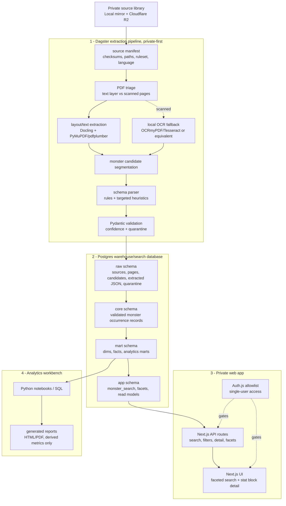

# MadTitan Bestiary - Architecture

> End-to-end private data platform that converts a library of D&D 5e bestiary PDFs
> into (1) a fast, deeply-filterable private monster search tool for a DM, and
> (2) a comprehensive analytics workbench over monster data.

---

## 1. Goals and non-goals

### Goals

- Turn around 50 bestiary PDFs, roughly 5,000 monsters, into clean and comprehensive
  structured data.
- Capture every useful monster attribute: stats, attacks, damage, traits, spellcasting,
  legendary/lair actions, lore fields, source provenance, and extraction confidence.
- Build a private website for fast monster discovery: fuzzy name search, full-text
  search inside traits/actions, and rich faceted filtering.
- Build a deep analytics layer for reports such as average damage/round vs CR, AC/HP
  vs CR, damage-type prevalence, and action-economy patterns.
- Make the repo a portfolio-grade showcase across data engineering, analytics
  engineering, and full-stack web.

### Non-goals for v1

- Multi-user or public access.
- Public distribution of extracted copyrighted data.
- Spells, monster creation, encounter simulator, favorites, compare views, or random
  generators.
- Hosted AI extraction by default.
- A separate cloud lakehouse or managed data warehouse. Postgres is the v1 warehouse,
  serving database, and search database.

### Guiding constraints

| Constraint                | Implication                                                                            |
| ------------------------- | -------------------------------------------------------------------------------------- |
| Low monthly cost          | Prefer free tiers, local compute, and a small cloud footprint.                         |
| Private data, public code | Raw PDFs, extracted text, exports, and secrets never enter Git.                        |
| Private-first extraction  | OCR/parsing runs locally first; uncertain records are quarantined.                     |
| Portfolio-grade stack     | Use Dagster, typed contracts, dbt, quality checks, faceting metadata, and strong docs. |
| Extensible                | Future domains add schemas/models, not a new platform.                                 |

### Sense of scale

The raw PDFs may be many GB, but the structured data is small: roughly 5,000 monsters
and low millions of relational rows once attacks, traits, damage relations, and bridge
tables are normalized. For v1, scaling is mostly a modeling and extraction-quality
problem, not an infrastructure-size problem.

---

## 2. Key v1 architecture decision

v1 is **Postgres-exclusive plus Dagster/private-first extraction**.

This deliberately replaces the previous Databricks/Gemini-first design:

- No Databricks in the critical path for v1.
- No hosted AI extraction in the default v1 pipeline.
- No separate FastAPI service unless the Next.js API surface becomes too large.
- No Cloudflare Access requirement until a custom domain is available.

The platform still keeps the best parts of the original architecture:

- Medallion-style modeling, implemented as Postgres schemas.
- dbt tests/docs and analytics marts.
- A strong dimensional/search model with JSONB escape hatches.
- A generic facet registry that drives API behavior and UI filters.
- Portfolio-friendly orchestration, lineage, data quality, and reports.

---

## 3. System overview



---

## 4. Tech stack and cost posture

| Layer            | Technology                                  | Cost posture          | Rationale                                                                   |
| ---------------- | ------------------------------------------- | --------------------- | --------------------------------------------------------------------------- |
| Raw storage      | Cloudflare R2 private bucket + local mirror | Free/low-cost storage | Keeps PDFs out of repo; local mirror keeps extraction cheap.                |
| Orchestration    | Dagster OSS                                 | Free, local           | Asset lineage, retries, partitions, checks, and portfolio-grade visibility. |
| PDF conversion   | Docling, PyMuPDF, pdfplumber                | Free, local           | Layout-aware extraction plus targeted fallback control.                     |
| OCR              | OCRmyPDF/Tesseract or equivalent local OCR  | Free, local           | Handles scanned pages without sending page images to third parties.         |
| Validation       | Pydantic v2                                 | Free                  | Shared schema contract and quarantine boundaries.                           |
| Warehouse/search | Postgres, likely Neon Free for v1           | Free tier first       | One trusted database for warehouse, app, and search.                        |
| Modeling         | dbt Core with Postgres adapter              | Free                  | Versioned SQL models, docs, and quality tests.                              |
| Search           | `pg_trgm`, Postgres FTS, GIN/B-tree indexes | Included              | Good enough for 5,000 monsters and detailed facets.                         |
| App/API          | Next.js + TypeScript API routes             | Free tier first       | One deployable web/backend surface.                                         |
| Auth             | Auth.js OAuth allowlist                     | Free                  | Works without a custom domain.                                              |
| Analytics        | Python notebooks, SQL, generated reports    | Free                  | Reproducible deep analysis without BI subscription.                         |
| CI/IaC           | GitHub Actions, Terraform where useful      | Free tier first       | Reproducible setup without overbuilding.                                    |

Optional later upgrades:

- Cloudflare Access when a custom domain exists.
- A dedicated search engine if Postgres stops being enough.
- A hosted or local LLM repair parser behind an explicit feature flag.
- A separate FastAPI service if API complexity grows.
- A lakehouse/Databricks layer only after privacy and data-sharing policy is settled.

---

## 5. The four systems in detail

### System 1 - Ingestion and extraction

Raw PDFs live in a private R2 bucket and a local mirror. The local mirror is the normal
compute source for extraction, because it keeps cost low and avoids moving copyrighted
page content through unnecessary services.

The pipeline is modeled as Dagster assets:

- `source_books`: manifest rows for each book, checksum, source id, language, ruleset,
  local path, R2 key, and extraction settings.
- `pdf_pages`: page inventory and text/scanned triage.
- `page_text`: text/layout extraction for pages with a usable text layer.
- `page_ocr_text`: local OCR output for scanned or low-text pages.
- `monster_candidates`: segmented candidate stat blocks with source page spans.
- `parsed_monsters`: structured JSON using the current schema contract.
- `validation_results`: accepted records, low-confidence records, and hard failures.
- `postgres_load`: idempotent loading into Postgres raw/core schemas.
- `mart_build` and `search_refresh`: dbt/model refresh and app read-model refresh.
- `report_build`: generated derived-metric analytics reports.

v1 is fully automatic in the sense that it does not require a manual review step before
successful records move forward. Uncertain records are quarantined and excluded from
search, app views, and analytics marts until a later parser improvement or explicit
repair path accepts them.

### System 2 - Postgres warehouse and search database

Postgres is the v1 warehouse, serving database, and search database. The model keeps a
medallion-like shape without introducing a separate lakehouse:

- `raw`: source books, page inventory, extracted text metadata, monster candidates,
  raw parsed JSON, parser logs, and quarantined records.
- `core`: validated monster occurrence records and normalized sub-entities.
- `mart`: dimensional/fact models and analytics-ready marts.
- `app`: denormalized search/read models, facet metadata, and app-safe views.

dbt runs against Postgres for transformations, tests, docs, and model lineage.

Search stays in Postgres for v1:

- Fuzzy name search via `pg_trgm`.
- Full-text search inside traits/actions via `tsvector`.
- Facets via indexed scalar columns, arrays, JSONB, or bridge-derived app views.
- Future semantic search can use `pgvector`, but it is not required for v1.

### System 3 - Private web app and API

The v1 app is a single Next.js project:

- API routes expose `/api/monsters`, `/api/monsters/:id`, and `/api/facets`.
- Auth.js gates all pages and API routes to an allowlisted owner identity.
- The UI focuses on dense DM workflows: fast search, filter sidebar, sortable results,
  detail view, source/page provenance, and clear quarantined-data exclusion.

A separate FastAPI service is deferred. It should be introduced only if the backend
needs independent scaling, Python-heavy behavior, or public API lifecycle management.

### System 4 - Analytics workbench

Analytics run from Postgres marts using SQL and Python notebooks. Generated reports are
derived-metric only for public/portfolio use and should not publish verbatim
copyrighted text.

Initial report families:

1. Damage/round vs CR with an over/under-tuned baseline.
2. AC and HP vs CR baselines and outliers.
3. Distributions of CR, creature type, size, source, and environment.
4. Damage-type prevalence and resistance/immunity landscape.
5. Action-economy analysis: multiattack, reactions, legendary/lair actions.

---

## 6. Extraction privacy and AI policy

v1 does not send raw PDFs, page images, extracted text, or copyrighted lore to hosted AI
services.

Allowed in v1:

- Local PDF parsing.
- Local OCR.
- Deterministic or heuristic stat-block parsing.
- Pydantic validation and confidence scoring.
- Synthetic/SRD fixtures for public tests.

Deferred and feature-flagged:

- Hosted AI repair parser for selected failed candidates.
- Local LLM repair parser for ambiguous records.
- Any provider-specific AI extraction workflow.

If an AI repair path is added later, the docs must define:

- Which fields may be sent.
- Whether lore/flavor text is excluded.
- Provider data retention/training policy.
- Audit logging for every sent excerpt.
- A non-AI fallback path.

---

## 7. Data captured

The exact schema will be refined after a field inventory across representative books.
The architecture commits to the categories below, not to a final table-by-table design
yet.

Expected v1 capture areas:

- Identity: name, size, creature type, subtype/tags, alignment, source book, page span,
  ruleset/source version, and image/art references if tracked privately.
- Defenses: AC, HP, hit dice formula, speeds, saving throws, skills, senses, languages,
  vulnerabilities, resistances, immunities, and condition immunities.
- Challenge: CR, XP, proficiency bonus, and source-specific challenge metadata if
  present.
- Abilities: STR, DEX, CON, INT, WIS, CHA and modifiers.
- Features: traits, special abilities, actions, bonus actions, reactions, legendary
  actions, lair actions, regional effects, mythic actions, and spellcasting.
- Per-attack detail: attack kind, to-hit bonus, reach/range, target, damage dice,
  average damage, damage type, riders, saves, conditions, and recharge rules.
- Lore/private text: description, environment/habitat, behavior, and other flavor
  fields, stored privately and never used in public samples.
- Provenance and quality: source, page span, parser version, extraction method,
  confidence, validation errors, and quarantine status.

Every monster occurrence is stored separately in v1, even if the same monster appears
in multiple books. Canonical grouping/deduplication can be added later as an optional
layer, but it must not destroy source-specific differences.

---

## 8. Provisional data model

The model should stay flexible until the extraction inventory is complete. Use a
hybrid approach:

- Typed normalized tables for stable, high-value query fields.
- JSONB escape hatches for rare, source-specific, or not-yet-modeled fields.
- App read models that flatten the data for fast filtering.
- Analytics marts that preserve enough grain for serious reports.

Candidate model shape:

**Raw schema**

- `raw.source_book`
- `raw.source_file`
- `raw.page`
- `raw.monster_candidate`
- `raw.parsed_monster_json`
- `raw.quarantine_record`
- `raw.extraction_run`

**Core schema**

- `core.monster_occurrence`
- `core.monster_stat`
- `core.monster_defense`
- `core.monster_speed`
- `core.monster_sense`
- `core.monster_language`
- `core.monster_damage_relation`
- `core.monster_condition_immunity`
- `core.monster_feature`
- `core.monster_attack`
- `core.monster_spellcasting`

**Mart schema**

- `mart.dim_monster_occurrence`
- `mart.dim_source_book`
- `mart.dim_creature_type`
- `mart.dim_size`
- `mart.dim_cr`
- `mart.dim_damage_type`
- `mart.fact_action`
- `mart.fact_attack`
- `mart.fact_damage_instance`
- `mart.monster_damage_by_cr`
- `mart.monster_defense_by_cr`
- `mart.action_economy`

**App schema**

- `app.monster_search`
- `app.monster_detail`
- `app.facet_registry`
- `app.facet_value_counts`

This is intentionally provisional. The final version should be driven by a field audit
of representative monsters and by the first parser test suite.

---

## 9. Generic, metadata-driven faceting

The app should support many filters without hardcoding every filter in bespoke code.
Use a facet registry in Postgres, optionally mirrored as checked-in seed data.

Each facet declares:

- `key`
- `label`
- `data_type`: categorical, range, boolean, multi-value, text, or relation.
- `source_model`: app view, mart, bridge, or JSONB path.
- `query_strategy`: equality, range, overlap, existence, full-text, or custom SQL.
- `display_order`
- `enabled`
- `index_hint` or expected supporting index.

Initial v1 facets:

- CR range.
- Creature type and subtype/tag.
- Size.
- Alignment.
- Source book.
- Damage dealt by attacks.
- Damage vulnerable/resistant/immune.
- Condition immunities.
- Senses.
- Movement type and speed ranges.
- Spellcaster.
- Legendary/lair/mythic flags.
- Environment/habitat.
- AC and HP ranges.

The `/api/facets` endpoint should return available facets, selected values, and counts
computed from accepted app read models only.

---

## 10. Website scope for v1

Required:

- Private login with Auth.js and an allowlisted identity.
- Fuzzy name search.
- Full-text search inside trait/action text.
- Faceted filtering driven by the facet registry.
- Monster result list optimized for scanning.
- Full stat block detail page or detail panel.
- Source/page provenance.
- Clear exclusion of quarantined records from normal results.

Deferred:

- Compare side-by-side.
- Favorites and shortlists.
- Random or "surprise me" generator.
- Semantic search.
- Public demo backed by real data.

---

## 11. Security and data governance

- Raw PDFs, extracted page text, parsed data, exports, reports with private content, and
  secrets are excluded from Git.
- R2 bucket is private and never serves public objects.
- Local mirror paths are configured outside the repo.
- Postgres connection strings live in environment variables or secret stores.
- The web app requires Auth.js authentication and an allowlisted user before any data
  route is available.
- Public tests and fixtures use only SRD/CC-BY or synthetic data.
- Public portfolio reports use derived metrics and synthetic examples, not verbatim
  commercial text.
- Quarantined records are excluded from app and mart schemas by default.

When a custom domain exists, Cloudflare Access can be added in front of the app as an
additional perimeter layer.

---

## 12. Extensibility and future domains

The integration point is the Postgres warehouse model plus shared schema contracts.
Future domains add new schemas/models and app surfaces:

- Spells: spell entities, effects, schools, classes, saving throws, damage, conditions,
  and monster spellcasting bridges.
- Monster creation: homebrew authoring path that writes into the same validated
  monster schema with `source_type = homebrew`.
- Encounter simulator: consumes attack/action-economy facts to model encounter
  difficulty and combat behavior.
- Canonical monster grouping: optional layer that groups repeated source occurrences
  without losing source-specific records.

---

## 13. Repository layout and rationale

```text
madtitan-bestiary/
  pipelines/      # Python: Dagster assets for ingest, extract, validate, load
  warehouse/      # dbt project targeting Postgres schemas and marts
  analytics/      # notebooks + generated reports
  web/            # Next.js + TypeScript app, API routes, Auth.js allowlist
  packages/       # shared schema/contracts and typed DB helpers
  infra/          # Terraform/config for R2, database, deployment, secrets docs
  samples/        # SRD/CC-BY or synthetic fixtures only
  .github/        # CI: tests, lint, dbt checks, docs checks
  docs/           # additional design docs
```

Why monorepo:

- One shared contract across extraction, dbt, API, web, and analytics.
- One solo-developer workflow.
- One portfolio story from raw PDFs to reports and UI.
- One CI configuration with path filtering.
- Easy to split later if a service needs independent release management.

---

## 14. Phased roadmap

| Phase               | Outcome                                                                                                             |
| ------------------- | ------------------------------------------------------------------------------------------------------------------- |
| 0 - Foundations     | Monorepo scaffold, secrets policy, sample fixtures, Postgres, R2, Dagster project, and first schema contract draft. |
| 1 - Field inventory | Review representative books and define the first extraction contract, keeping the model provisional.                |
| 2 - Extraction MVP  | One text-based book through local parsing, Pydantic validation, quarantine, and Postgres raw/core load.             |
| 3 - OCR path        | Add scanned-page triage and local OCR for mixed PDFs.                                                               |
| 4 - Modeling        | dbt raw/core/mart/app models, data tests, docs, and accepted-only read models.                                      |
| 5 - Search API      | Next.js API routes for search, detail, and facets using Postgres indexes.                                           |
| 6 - Website         | Private faceted search UI and detail pages behind Auth.js allowlist.                                                |
| 7 - Analytics       | Notebooks and generated derived-metric reports.                                                                     |
| 8 - Hardening       | CI, seed data, performance checks, backup/restore notes, portfolio docs.                                            |
| Future              | Spells, homebrew monster creation, encounter simulator, optional canonical grouping.                                |

---

## 15. Open questions and risks

- Final monster schema is not locked. It should follow a representative field audit
  rather than the first attractive table design.
- Local OCR quality may vary across older/scanned books. A golden synthetic/SRD test set
  and per-source success metrics are required.
- Pure deterministic parsing may struggle with unusual layouts. The first mitigation is
  quarantine and parser improvements; optional AI repair is a later explicit decision.
- Postgres is intentionally enough for v1, but complex analytics may need careful mart
  design and indexing.
- Auth.js protects the v1 app, but Cloudflare Access should be revisited when a custom
  domain exists.
- Copyright boundaries must stay explicit in tests, reports, screenshots, demos, and
  future AI workflows.
