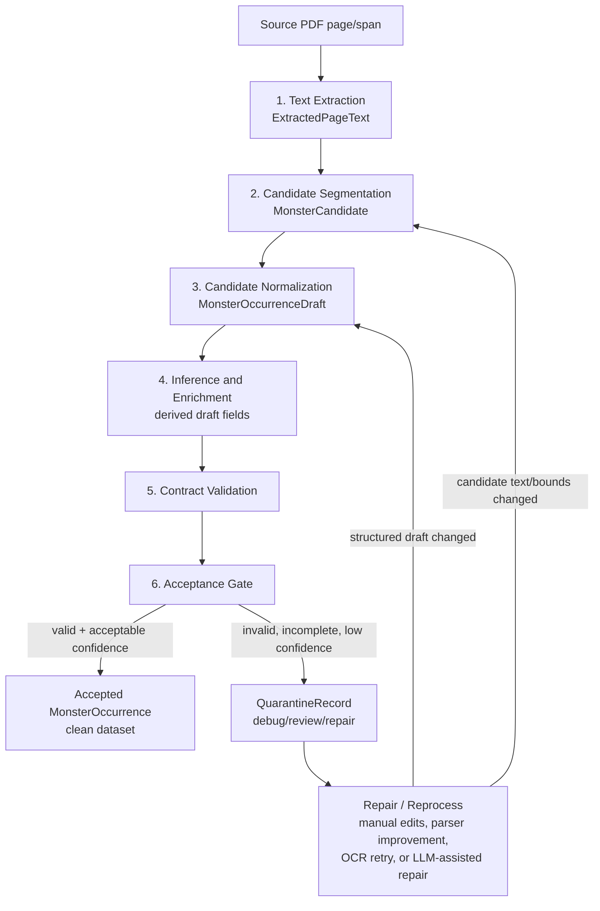

# Extraction Pipeline

This document defines the names and intermediate objects used by the private-first
monster extraction pipeline.

## Canonical Steps

```text
PDF
-> Text Extraction
-> Candidate Segmentation
-> Candidate Normalization
-> Inference and Enrichment
-> Contract Validation
-> Acceptance Gate
-> MonsterOccurrence or QuarantineRecord
```

### 1. Text Extraction

Input: a source PDF/book from a user-provided `SourceBook` manifest.

Output: one or more page-level `ExtractedPageText` attempt records.

This step turns page content into readable text. It does not try to understand the stat
block yet. A full 200-300 page bestiary can be processed in one extraction job, but the
persisted output is page-level so individual pages can be retried, inspected, or linked
to candidates.

Book title, ruleset, file identity, and extraction settings come from `SourceBook`.
They are not inferred from OCR or LLM output in v1.

Supported extraction methods:

- `pdf_text_layer`: read the embedded PDF text/OCR layer.
- `local_ocr`: run local OCR against page images.
- `llm_vision_text`: use an explicitly approved vision-capable LLM to transcribe page
  images when local text extraction fails.
- `manual_transcription`: manually typed text for tests or repair.

The output should preserve source page identity, extraction method, confidence, and
quality notes. Raw extracted text remains private data and must not be committed unless
it is synthetic or clearly licensed.

Each extraction method attempt is stored separately. For example, page 352 can have a
`pdf_text_layer` attempt and a `local_ocr` retry attempt. Candidate Segmentation chooses
which extracted page text IDs to use.

LLM or vision-assisted image/lore observations are stored as `PageContentAnnotation`
records. These annotations are page-level hints; they do not write directly to
`MonsterOccurrence.content_flags` or `MonsterOccurrence.lore`.

### 2. Candidate Segmentation

Input: `ExtractedPageText`.

Output: one or more `MonsterCandidate` records.

This step asks: "Where are the monster stat blocks in this text?"

It identifies likely monster boundaries, page spans, name hints, section text, and
candidate-level confidence. A candidate can still be messy, incomplete, or wrong. It is
not trusted structured data.

This is the first monster-aware filtering step. Pages without monster stat blocks
produce no candidates. Multi-page stat blocks produce one `MonsterCandidate` with
multiple `lineage.extracted_page_text_ids`.

The extraction workflow is intentionally source-by-source. A single bestiary PDF will
usually follow one consistent stat-block pattern, while different PDFs may use
different headings, ordering, layouts, action labels, or optional sections. The
`MonsterCandidate` contract should therefore stay broad enough to capture source-level
variation and debugging context. The final `MonsterOccurrence` contract remains the
strict, normalized target.

### 3. Candidate Normalization

Input: `MonsterCandidate`.

Output: `MonsterOccurrenceDraft`.

This step converts a candidate into the shape expected by the shared monster contract.
It extracts and normalizes fields such as AC, HP, speeds, abilities, attacks, damage,
conditions, spellcasting metadata, legendary actions, habitats, accepted lore, and
provenance.

This step may be deterministic, heuristic, LLM-assisted, or manual, but it must record
the normalizer version and method.

The first implementation is intentionally narrow: it reads hand-authored or pre-parsed
`candidate.structured_fields`, fills provenance from the candidate, and emits a
`MonsterOccurrenceDraft` only when the payload already satisfies the current monster
contract. Source-specific normalizers can later replace this input with structured
fields parsed from raw candidate sections.

Source-specific fields follow a promotion path during normalization:

- Keep raw, rare, or source-only oddities in `source_specific_fields`.
- Promote useful source-specific concepts to `extended_attributes` when they should
  travel with the final `MonsterOccurrence` as optional normalized data.
- Use `uncategorized`, `not_source_provided`, or another explicit status when the
  concept is useful globally but missing from a particular source.
- Promote to a top-level typed field only after the concept becomes common enough for
  core validation, app filtering, or analytics.

Lore has two representations:

- `PageContentAnnotation` stores the extraction clue: "this page appears to contain
  lore for this monster name hint."
- `MonsterOccurrence.lore` stores the accepted decision: "this source-specific monster
  occurrence has this lore text/ref."

This keeps extraction evidence separate from the clean occurrence data used by the app
and warehouse.

### 4. Inference and Enrichment

Input: `MonsterOccurrenceDraft`.

Output: enriched `MonsterOccurrenceDraft`.

Before a draft is quarantined, the pipeline gets one chance to fill mechanically
derived fields from information that was actually present in the stat block or parser
payload. This layer should stay conservative: it must not invent uncertain facts.

Current inferred fields include:

- `challenge.proficiency_bonus`, when challenge rating is present.
- ability modifiers, when ability scores are present.
- ability scores, when only modifiers are present. Because a modifier maps to a score
  range, the current deterministic default is the lowest score in that range.
- ability saving throws, when no explicit saving throw value is present. The default
  saving throw equals the ability modifier.
- `initiative`, when no explicit initiative is present and Dexterity modifier is
  available. The inferred bonus equals the Dexterity modifier and the static value is
  `10 + bonus`.
- `has_bonus_actions`, when bonus action records are present.
- `has_reactions`, when reaction records are present.
- `legendary_status`, when legendary actions, action uses, or resistance are present.
- `has_lair_variant`, when lair XP, lair action data, or lair-specific uses are
  present.
- `damage_types_dealt` and `conditions_inflicted`, when direct feature/action records
  provide those values.
- `raw_json`, when candidate structured fields exist but the draft did not preserve
  the raw parser payload.

Inference warnings are stored on the draft normalization metadata so later review can
see which values were copied or derived.

Default values that do not need policy checks:

- `alignment` defaults to `not_provided`.
- `habitats` defaults to an empty list, which means habitat is not defined yet.
- empty optional sections such as `bonus_actions`, `reactions`, `legendary_actions`,
  and `lair_actions` default to empty lists.

### 5. Contract Validation

Input: `MonsterOccurrenceDraft`.

Output: either a valid `MonsterOccurrence` or validation errors.

This step validates the draft against the Pydantic `MonsterOccurrence` contract. The
fixture validator CLI is the first implementation of this check.

### 6. Acceptance Gate

Input: validation result plus candidate and provenance metadata.

Output:

- `MonsterOccurrence`, if the draft is valid and confidence is acceptable.
- `QuarantineRecord`, if the draft is invalid, low-confidence, incomplete, or requires
  review.

The acceptance gate is the boundary between raw/private extraction work and the clean
dataset used by app/search/analytics models.

The default `AcceptancePolicy` is stricter than the base Pydantic contract. It requires:

- `name`
- `size`
- `creature_type`
- `armor_class`
- `hit_points`
- at least one speed
- `abilities`
- `challenge.rating`
- `challenge.proficiency_bonus`
- at least one action-style section: action, bonus action, reaction, legendary action,
  or lair action
- `provenance`
- non-empty `raw_json`

Challenge XP and lair XP are useful when provided, but they are not currently required
for acceptance.

## Flow Chart



Quarantine is not a dead end. A quarantined record can be reviewed manually, retried
with a better extraction method, repaired by a future parser, or passed through an
approved LLM-assisted repair path. After repair, it re-enters the pipeline at Candidate
Segmentation or Candidate Normalization, depending on what changed.

## Pipeline Objects

### SourceBook

`SourceBook` is the user-provided manifest row for one private PDF/book. It supplies
book-level facts that extraction attempts inherit.

Recommended fields:

```json
{
  "source_book_id": "monster-manual-2024",
  "book_title": "Monster Manual 2024",
  "ruleset": "DND 5.5e",
  "source_file_id": "mm2024-filehash",
  "source_file_checksum": "sha256:...",
  "local_source_ref": "private://local-pdf-mirror/monster-manual-2024.pdf",
  "private_source": true,
  "extraction_settings": {
    "preferred_methods": ["pdf_text_layer", "local_ocr", "llm_vision_text"],
    "page_start": 1,
    "page_end": 384,
    "render_dpi": 220,
    "allow_llm_vision": true,
    "metadata": {}
  },
  "metadata": {}
}
```

### ExtractedPageText

`ExtractedPageText` represents one private text extraction attempt for one source page.
Use `text_ref` for real extracted text by default. Inline `text` is only for synthetic,
redacted, or clearly licensed fixtures.

Recommended fields:

```json
{
  "extracted_page_text_id": "mm2024-filehash-p0255-text-v1",
  "source": {
    "source_book_id": "monster-manual-2024",
    "book_title": "Monster Manual 2024",
    "ruleset": "DND 5.5e",
    "source_file_id": "mm2024-filehash",
    "source_file_checksum": "sha256:...",
    "page_number": 255,
    "page_label": "255"
  },
  "extraction": {
    "method": "pdf_text_layer",
    "status": "succeeded",
    "tool_name": "pymupdf",
    "tool_version": "x.y.z",
    "run_id": "extract-run-2026-06-11T05:00:00Z",
    "confidence": 0.92,
    "quality": "good",
    "warnings": []
  },
  "text": null,
  "text_ref": "private://extracted-text/mm2024/p0255/pdf-text-v1.txt",
  "text_hash": "sha256:...",
  "layout": {
    "has_text_layer": true,
    "is_scanned": false,
    "page_width": 612,
    "page_height": 792,
    "page_unit": "pt",
    "blocks": [
      {
        "block_id": "mm2024-p0255-b001",
        "text": null,
        "text_ref": "private://extracted-text/mm2024/p0255/blocks/b001.txt",
        "bbox": {
          "page": 255,
          "x0": 0.05,
          "y0": 0.04,
          "x1": 0.95,
          "y1": 0.25,
          "unit": "page_ratio"
        },
        "confidence": 0.92,
        "reading_order": 0
      }
    ]
  },
  "created_at": "2026-06-11T05:00:00Z"
}
```

Validation rules:

- `succeeded` and `partial` extraction attempts require either `text` or `text_ref`.
- `failed` extraction attempts can omit text but must include at least one warning.
- Page blocks require either inline block `text` or `text_ref`.

### PageContentAnnotation

`PageContentAnnotation` stores page-level monster image and lore ownership hints from
approved vision-assisted review or manual annotation.

Recommended fields:

```json
{
  "annotation_id": "mm2024-p0255-vision-annotation-v1",
  "extracted_page_text_id": "mm2024-p0255-pdf-text-v1",
  "source_book_id": "monster-manual-2024",
  "page_number": 255,
  "method": "llm_vision_annotation",
  "run_id": "vision-run-2026-06-11",
  "confidence": 0.86,
  "detections": [
    {
      "kind": "monster_image",
      "monster_name_hint": "Adult Red Dragon",
      "bbox": {
        "page": 255,
        "x0": 0.62,
        "y0": 0.02,
        "x1": 0.98,
        "y1": 0.24,
        "unit": "page_ratio"
      },
      "confidence": 0.88,
      "notes": "Likely creature illustration associated with the page heading."
    },
    {
      "kind": "monster_lore",
      "monster_name_hint": "Adult Red Dragon",
      "text": null,
      "text_ref": "private://monster-lore/mm2024/adult-red-dragon/p0255/lore-v1.txt",
      "text_hash": "sha256:...",
      "text_span_ref": "private://extracted-text/mm2024/p0255/lore-span-v1",
      "block_ids": ["mm2024-p0255-b-lore"],
      "confidence": 0.82,
      "notes": "Lore-style prose associated with the same creature."
    }
  ],
  "created_at": "2026-06-11T05:02:00Z",
  "metadata": {}
}
```

These detections are hints. Candidate Segmentation and Candidate Normalization decide
whether they map to a final accepted monster occurrence.

Image detections use `bbox` to locate the source image region on the page. A future
image extraction step can render the PDF page, crop the detected bbox, store the image
asset in R2/S3-style object storage, and save only the resulting image reference and
metadata in the database.

### MonsterCandidate

`MonsterCandidate` is the proposed stat-block segment produced by Candidate
Segmentation. It should contain enough context to debug failed parsing and to reproduce
how the candidate was created.

Recommended structure:

```json
{
  "candidate_id": "mm2024-p0255-adult-red-dragon-candidate-v1",
  "status": "pending",
  "source": {
    "source_book_id": "monster-manual-2024",
    "book_title": "Monster Manual 2024",
    "ruleset": "DND 5.5e",
    "source_file_id": "mm2024-filehash",
    "source_file_checksum": "sha256:...",
    "page_start": 255,
    "page_end": 255,
    "page_labels": ["255"]
  },
  "source_format": {
    "profile_id": "mm2024-statblock",
    "profile_version": "v1",
    "statblock_family": "dnd_2024",
    "layout_type": "two_column_card",
    "expected_single_page": true,
    "column_count": 2,
    "section_order": ["header", "traits", "actions", "legendary_actions"],
    "heading_patterns": ["uppercase_red_heading"],
    "known_variations": ["spellcasting_action", "lair_variant_xp"],
    "notes": "Observed source-level conventions for this PDF.",
    "metadata": {}
  },
  "lineage": {
    "extracted_page_text_ids": ["mm2024-filehash-p0255-text-v1"],
    "extraction_methods": ["pdf_text_layer"],
    "segmentation_run_id": "segment-run-2026-06-11T05:10:00Z",
    "segmentation_method": "heading_and_statblock_rules",
    "segmenter_version": "segmenter-v0.1.0",
    "parent_candidate_id": null,
    "repair_source_quarantine_record_id": null
  },
  "candidate": {
    "name_hint": "Adult Red Dragon",
    "creature_type_hint": "dragon",
    "structured_fields": {},
    "page_span_text": "private candidate text",
    "page_span_text_ref": null,
    "sections": [
      {
        "label": "header",
        "text": "private section text"
      },
      {
        "label": "actions",
        "text": "private section text"
      }
    ],
    "start_marker": "ADULT RED DRAGON",
    "end_marker": "LEGENDARY ACTIONS",
    "raw_text_hash": "sha256:..."
  },
  "location": {
    "page_start": 255,
    "page_end": 255,
    "text_start_offset": 0,
    "text_end_offset": 2800,
    "bounding_boxes": [
      {
        "page": 255,
        "x0": 0.05,
        "y0": 0.04,
        "x1": 0.95,
        "y1": 0.96,
        "unit": "page_ratio"
      }
    ]
  },
  "quality": {
    "confidence": 0.88,
    "text_quality": "good",
    "segmentation_quality": "complete",
    "warnings": [
      {
        "code": "possible_wrapped_action",
        "message": "One action may continue across a column break."
      }
    ]
  },
  "normalization": {
    "recommended_method": "deterministic_rules",
    "attempt_count": 0,
    "last_attempt_at": null
  },
  "audit": {
    "created_at": "2026-06-11T05:10:00Z",
    "created_by": "candidate_segmentation",
    "private_content": true,
    "updated_at": null
  }
}
```

Field guidance:

- `candidate_id`: stable identifier for this candidate version.
- `status`: usually `pending`, `accepted`, `quarantined`, `superseded`, or `ignored`.
- `source`: book/file/page identity needed for provenance and debugging.
- `source_format`: source-level stat-block conventions. This is where per-PDF
  differences belong: layout family, expected section order, heading patterns,
  single-page vs multi-page expectations, and known variations.
- `lineage`: links back to extracted text and the segmentation code/run that produced
  the candidate.
- `lineage.extraction_methods`: extraction methods used upstream, such as
  `pdf_text_layer`, `local_ocr`, `llm_vision_text`, or `manual_transcription`.
- `lineage.parent_candidate_id`: previous candidate if this candidate is a revised
  version.
- `lineage.repair_source_quarantine_record_id`: quarantine record that caused this
  repaired candidate to be created.
- `candidate.name_hint`: best-effort monster name; not trusted until normalization and
  validation succeed.
- `candidate.structured_fields`: optional manual, fixture, heuristic, or source-parser
  output that is ready to be shaped into a `MonsterOccurrenceDraft`. This is the first
  normalizer input, but raw section text remains the long-term source of truth.
- `candidate.page_span_text`: private raw candidate text. Do not commit real book text.
- `candidate.page_span_text_ref`: storage reference for private text when the raw body
  is too large or sensitive to copy inline.
- `candidate.sections`: optional labeled chunks that make normalization easier.
- `location`: text offsets and optional bounding boxes for visual QA and page-image
  repair.
- `quality`: confidence, quality labels, and warnings from segmentation.
- `normalization`: tracks whether this candidate has been tried before and which
  method should handle it.
- `audit.private_content`: true for real extracted book content.

### MonsterOccurrenceDraft

`MonsterOccurrenceDraft` is a proposed structured object shaped like
`MonsterOccurrence`, but not accepted yet. The `monster` payload is still a plain JSON
object so incomplete drafts can be preserved for debugging.

Contract wrapper:

```json
{
  "draft_id": "mm2024-p0255-adult-red-dragon-draft-v1",
  "candidate_id": "mm2024-p0255-adult-red-dragon-candidate-v1",
  "normalization": {
    "method": "deterministic_rules",
    "normalizer_version": "normalizer-v0.1.0",
    "run_id": "normalize-run-2026-06-11T05:20:00Z",
    "confidence": 0.86,
    "warnings": []
  },
  "monster": {
    "name": "Adult Red Dragon"
  }
}
```

The `monster` payload is what Contract Validation checks.

Accepted occurrence lore should be represented in the `monster` payload as:

```json
{
  "content_flags": {
    "has_lore": true
  },
  "lore": {
    "text": null,
    "text_ref": "private://monster-lore/mm2024/adult-red-dragon/p0255/lore-v1.txt",
    "text_hash": "sha256:...",
    "source_page_start": 255,
    "source_page_end": 255,
    "block_ids": ["mm2024-p0255-b-lore"],
    "confidence": 0.9,
    "notes": "Accepted lore associated with this source-specific occurrence."
  }
}
```

Inline `lore.text` is allowed for synthetic, redacted, or licensed fixtures. Real
private lore should use `text_ref`.

Current implementation:

- `normalize_candidate(candidate)` returns a `MonsterOccurrenceDraft` when
  `candidate.structured_fields` can satisfy the monster contract.
- It returns a `QuarantineRecord` when structured fields are missing or contract
  validation fails.
- `accept_draft(draft)` runs inference, validates the draft contract, applies the
  `AcceptancePolicy`, and then returns a clean `MonsterOccurrence` or a
  `QuarantineRecord`.

### QuarantineRecord

`QuarantineRecord` stores failed, incomplete, or low-confidence work without losing
debug context.

Recommended structure:

```json
{
  "quarantine_record_id": "quarantine-mm2024-p0255-adult-red-dragon-v1",
  "candidate_id": "mm2024-p0255-adult-red-dragon-candidate-v1",
  "draft_id": "mm2024-p0255-adult-red-dragon-draft-v1",
  "reason": "contract_validation_failed",
  "severity": "review_required",
  "source": {
    "book_title": "Monster Manual 2024",
    "ruleset": "DND 5.5e",
    "page_start": 255,
    "page_end": 255
  },
  "errors": [
    {
      "path": "hit_point_formula.die_type",
      "message": "String should match pattern '^d\\\\d+$'",
      "code": "string_pattern_mismatch"
    }
  ],
  "raw_candidate_ref": "raw.monster_candidate:mm2024-p0255-adult-red-dragon-candidate-v1",
  "draft_payload": {},
  "repair": {
    "eligible_for_manual_review": true,
    "eligible_for_ocr_retry": false,
    "eligible_for_llm_repair": true,
    "next_recommended_step": "manual_review"
  },
  "audit": {
    "created_at": "2026-06-11T05:21:00Z",
    "parser_version": "normalizer-v0.1.0",
    "private_content": true
  }
}
```

Quarantine records should preserve enough information to reproduce the failure, but
large private text bodies can be stored by reference rather than copied repeatedly.

## Naming Summary

Processes:

- Text Extraction
- Candidate Segmentation
- Candidate Normalization
- Contract Validation
- Acceptance Gate

Objects:

- `SourceBook`
- `ExtractedPageText`
- `PageContentAnnotation`
- `MonsterCandidate`
- `MonsterOccurrenceDraft`
- `MonsterOccurrence`
- `QuarantineRecord`

Future pipeline objects:

- `MonsterImageAsset`: cropped monster image asset generated from a page image bbox,
  stored in object storage, and linked back to the accepted monster occurrence.
- `MonsterRelationship`: relationship/graph edge connecting monster identities or
  occurrences, such as same-monster renditions across books or lore/mechanical
  associations between different monsters.
